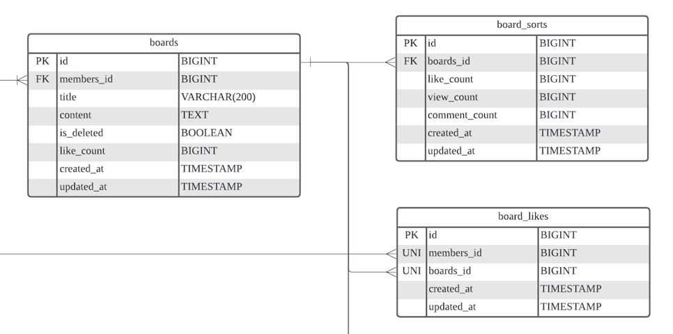

### [배경]

- 게시판 프로젝트 [[링크]](https://github.com/hsw0905/NPEC)를 진행하면서 500만개의 가데이터를 넣고 테스트를 돌려본 결과, 눈에 띄게 병목이 생기는 구간이 있었습니다.
바로 조회수를 증가시키는 부분이었는데요. 초기 boards(게시물 테이블) 설계에서는 게시물 테이블에 조회수 칼럼을 같이 가지고 있어서 <strong>사용자가 게시물을 볼 때마다 조회수를 업데이트하는 쿼리가 발생하고 있었습니다.</strong>
이런 방식이라면 사용자가 많아진다고 가정했을 때, 게시물 읽기에 많은 트래픽이 집중된다면 많은 업데이트 작업으로 인한 성능 저하가 예상되었습니다. 
게시글 성격에 따라 충분히 발생할만한 이슈로 생각되었고, 이런 문제는 어떻게 처리하면 좋을지 궁금했습니다.
---
### [문제]

- 하나의 게시물엔 사용자가 좋아요를 표시할 수 있고, 댓글을 작성할 수도 있습니다. 이렇게 되면 게시물을 읽을 때마다
좋아요 개수, 댓글 개수를 카운트 하기 위해 좋아요 테이블(board_likes), 댓글 테이블을 매번 조인해야 하는 상황이 발생하게 되는데요.
이 문제를 해결하기 위해 <strong>조회수 관련 칼럼들을 역정규화하여 별도의 테이블로 분리하였습니다.</strong> 
왜냐하면 조회수 관련 칼럼은 각 게시물마다 유일하게 존재하며, 다른 테이블과 연결되는 관계도 없었습니다.
따라서, 조회수 칼럼은 역정규화하여 중복을 허용하는 것이 가능하다고 판단하였습니다.

---
### [새로운 문제]

- 위와 같이 테이블을 나누었더니 게시물을 가져오면서 조회수 테이블만 참조하여 보여주면 되도록 개선하였습니다.
하지만 새로운 문제를 만나게 되었습니다.
예를 들어, 게시물 하나에 사용자가 좋아요 표시를 하게 된다면, 좋아요 테이블(board_likes)에 insert 작업이 생기면서 board_sorts 테이블에 like_count 값을 +1 증가시켜야 합니다.
이 두 작업은 같이 일어나야 했기 때문에 하나의 트랜잭션 안에 묶여 있었고, JPA의 Dirty-Checking으로 like_count 값이 업데이트 되는 구조였습니다.
만약에 좋아요를 업데이트 하는 트랜잭션 도중에 다른 누군가가 좋아요를 증감시킨다면, 경쟁 상태(Race-Condition)가 발생하여 데이터 정합성이 맞지 않을 수 있게 됩니다.
---
### [해결 방법]

1. Lock 
- 쿼리에 락을 걸어 데이터 정합성을 맞출 수 있습니다. 하지만 이 방법은 조회 쿼리에 락을 걸게 되면 트랜잭션이 끝날 때까지 기다려야 하기 때문에, 성능이 나빠질 우려가 있었습니다.  
2. Native Query
- 네이티브 쿼리를 이용해 board_sorts 테이블 자체의 카운트 값을 +1 시키는 방법입니다. 읽은 값을 바로 업데이트 하기 때문에 동시성 문제를 해결할 수 있습니다.
- 하지만 조회수 관련 값은 빈번하게 변하는 값으로, 매번 업데이트를 하게 되면 서버에 무리가 갈 수 있다고 판단하였습니다.
3. Sync Schedule
- @Scheduled를 이용하여 정합성을 맞추는 방법입니다. 즉, 특정 주기마다 조회수 관련 값을 맞춰 데이터 정합성을 지키게 합니다.
- 이 방법은 업데이트 주기가 오기 전까지는 조회수 값이 맞지 않을 수 있습니다. 또한 여러 서버에서 스케쥴이 병렬적으로 발생하게 된다면 리소스가 낭비될 수 있습니다.
4. event + queue + @Scheduled
- 조회수에 변경이 일어나면 이벤트를 발생시켜 Queue에 넣게 됩니다. 그리고 Queue에 있는 이벤트를 @Scheduled를 이용해 처리하는 방법입니다.
- 이 방법은 여러 서버에서 각각 하나의 Queue만 바라보고 있으며, 각 서버는 해당 Queue 하나의 이벤트만 처리하면 되기 때문에 Sync Schedule 방법보다 더 효율이 좋다고 판단했습니다.

### [구현]

- 좋아요/취소가 발생하면 이벤트를 발행합니다(Publisher)
```Java
@Service
public class BoardService {
    ...
    private final BoardRepository boardRepository;
    private final BoardLikeRepository boardLikeRepository;
    private final ApplicationEventPublisher eventPublisher;
    ...
    
    @Transactional
    public void likeBoard(Long boardId, Long memberId) {
        Member findMember = findMember(memberId);
        Board findBoard = findBoard(boardId);

        if (boardLikeRepository.existsByMemberIdAndBoardId(findMember.getId(), findBoard.getId())) {
            throw new MemberAlreadyLikeBoardException("이미 추천한 게시물 입니다.");
        }
        boardLikeRepository.save(new BoardLike(findMember, findBoard));

        eventPublisher.publishEvent(BoardLikeCreatedEvent.of(boardId));
    }
```
- Event Handler에서 Queue(Redis Set 사용)에 이벤트를 담습니다.
```Java
@Component
public class BoardLikeEventHandler {
    private final RedisTemplate<String, Object> redisTemplate;
    private final ObjectMapper mapper;

    public BoardLikeEventHandler(RedisTemplate<String, Object> redisTemplate, ObjectMapper mapper) {
        this.redisTemplate = redisTemplate;
        this.mapper = mapper;
    }

    @TransactionalEventListener
    public void increaseBoardLikeCount(BoardLikeCreatedEvent event) throws JsonProcessingException {
        SetOperations<String, Object> setOps = redisTemplate.opsForSet();
        BoardLikeModifiedMessage message = new BoardLikeModifiedMessage(event.getBoardId());
        String jsonString = mapper.writeValueAsString(message);

        setOps.add("boardLike", jsonString);
    }
}

```
- queue 에 있는 이벤트를 @Scheduled 로 주기적으로 실행합니다.
```Java
@Service
@Slf4j
public class ScheduledService {
    private final RedisTemplate<String, Object> redisTemplate;
    private final BoardLikeCountSyncService boardLikeCountSyncService;
    private final ObjectMapper mapper;

   ...

    @Scheduled(fixedDelay = 10000)
    public void run() {
        List<Object> boardLikeEvents = redisTemplate.opsForSet().pop("boardLike", 100);

        if (CollectionUtils.isEmpty(boardLikeEvents)) {
            return;
        }

        List<BoardLikeModifiedMessage> messages = convertMessageFromEvent(boardLikeEvents);

        boardLikeCountSyncService.updateBoardSortsLikeCount(messages);
    }

    private List<BoardLikeModifiedMessage> convertMessageFromEvent(List<Object> messages) {
        return messages.stream()
                .map(message -> {
                    try {
                        return mapper.readValue((String) message, BoardLikeModifiedMessage.class);
                    } catch (JsonProcessingException e) {
                        log.error("BoardLikeModifiedMessage.class 로 변환 에러. value: {}", message);
                        throw new RuntimeException(e);
                    }
                }).toList();
    }

}
```
